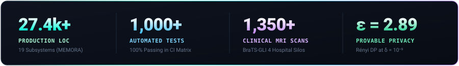
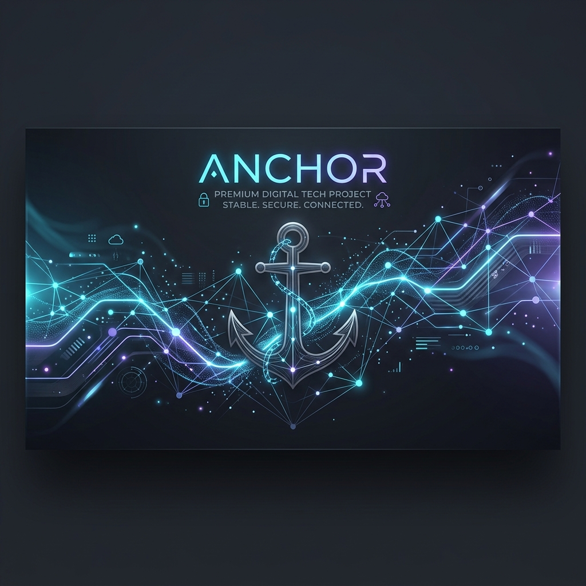
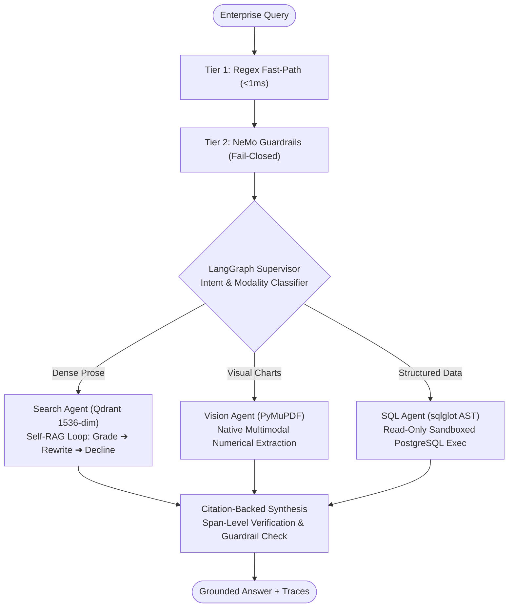

<div align="center">

<!-- Custom Header Vector Banner -->
<a href="https://github.com/Sidd927">
  
</a>

<br/><br/>

<!-- Dynamic Animated Typing Subtitle -->
<a href="https://github.com/Sidd927">
  
</a>

<br/>

<!-- Quick Social & Contact Badges -->
<p align="center">
  <a href="https://github.com/Sidd927">
    
  </a>
  &nbsp;
  <a href="mailto:siddhantpatil.hak@gmail.com">
    
  </a>
  &nbsp;
  <a href="https://github.com/Sidd927">
    
  </a>
  &nbsp;
  <a href="https://komarev.com/ghpvc/?username=Sidd927&style=for-the-badge&color=00c2ff&label=PROFILE+VIEWS">
    
  </a>
</p>

<!-- Executive Metrics Overview -->
<a href="https://github.com/Sidd927">
  
</a>

</div>

---

## 📌 Executive Summary

I am an **AI Systems & Distributed Software Engineer** and builder specializing in high-stakes engineering domains: **edge cognitive architectures**, **privacy-preserving federated machine learning**, **agentic multi-modal RAG systems**, and **passive cryptographic network forensics**.

My engineering philosophy rejects naive API wrappers and non-deterministic black boxes. Instead, I focus on:

* 🧩 **Deterministic Control Planes:** Coupling generative AI components with deterministic state machines, pure scoring functions, and AST-level query validation.
* 🔒 **Provable Privacy Guarantees:** Implementing analytical $(\varepsilon, \delta)$-Rényi Differential Privacy and homomorphic encryption (CKKS) to enable multi-institutional model training without raw data centralization.
* 🎯 **Evidence-Grade Grounding:** Enforcing multi-turn Self-RAG loops, cross-encoder reranking, and RFC-bounded evidence tracing so every system output is auditable and hallucination-free.
* 🧪 **Zero-Compromise Test Rigor:** Maintaining over 1,000+ automated unit, integration, and security test suites across mission-critical codebases (100% passing test rates across RC releases).

---

## 🏆 Verified Milestones & Hackathon Highlights

| Milestone / Event | Role & Architecture | Verified Impact & Scope |
| :--- | :--- | :--- |
| **Samsung Solve For Tomorrow** | **Architecture & Core Engineering Lead**<br/>`MEMORA (Samsung_Anchor)` | Developed a 19-subsystem deterministic cognitive companion architecture for Alzheimer's patients. **27,423 production LOC**, **479 passing automated tests (100%)**, offline-capable edge runtime, and FHIR/HL7 clinical interoperability. |
| **Smart India Hackathon 2026**<br/>*(Problem SIH26159 — NTRO)* | **Systems & Security Engineer**<br/>`SecureMailScope` | Built an offline, passive PCAP cryptographic security posture assessment tool for SMTP/IMAP/POP3. Delivers RFC-standard transport evaluation, TLS 1.3 downgrade detection, and forensic workbench with zero runtime core dependencies. |
| **BraTS-GLI 2024 Clinical Cohort** | **Federated ML Architect**<br/>`FedMed` | Scaled a 4-hospital cross-silo federated learning platform across 1,350 clinical 3D MRI scans with Poisson Rényi Differential Privacy ($\varepsilon=2.8934, \delta=10^{-5}$), FedAvg, and **323 passing automated tests**. |
| **Smart India Hackathon 2026**<br/>*(Ayush IPR Regulatory)* | **Lead RAG Architect**<br/>`IP-SAKTI Sahayak` | Architected a multilingual, source-grounded RAG system with Knowledge Graph traversal, dual national/international legal corpus routing, and Bhashini voice assistance. |
| **Magnitude National Hackathon** | **1st Prize Winner** | Secured First Place in competitive national hackathon (D.Y. Patil College of Engineering). |

---

## 🛠️ Technical Competencies & Toolchain

<table>
  <tr>
    <td width="20%" valign="top"><strong>🧠 AI &amp; Deep Learning</strong></td>
    <td>
      
      
      
      
      
      
      
    </td>
  </tr>
  <tr>
    <td width="20%" valign="top"><strong>🕸️ Agentic RAG &amp; LLMs</strong></td>
    <td>
      
      
      
      
      
      
    </td>
  </tr>
  <tr>
    <td width="20%" valign="top"><strong>⚙️ Backend &amp; Distributed</strong></td>
    <td>
      
      
      
      
      
      
      
    </td>
  </tr>
  <tr>
    <td width="20%" valign="top"><strong>🎨 Frontend &amp; Telemetry</strong></td>
    <td>
      
      
      
      
      
      
    </td>
  </tr>
  <tr>
    <td width="20%" valign="top"><strong>🛡️ Security &amp; Privacy</strong></td>
    <td>
      
      
      
      
      
    </td>
  </tr>
</table>

---

## 🚀 Featured Flagship Engineering Projects

### 1. [MEMORA — Deterministic Cognitive Companion Architecture](https://github.com/Sidd927/Samsung_Anchor)
> **Samsung Solve For Tomorrow — Release Candidate 1 (RC1)**  
> *Deterministic edge-AI cognitive companion operating as an external memory and reasoning OS for individuals living with Alzheimer's disease.*

<div align="center">
  
</div>

<br/>

* **Architectural Depth:** 19 decoupled subsystems spanning the **Cognitive OS (COS)**, working memory attention loops, semantic knowledge graphs, executive function planning, and FHIR/HL7 clinical interoperability.
* **Offline-First & Hardware-Agnostic:** Operates completely disconnected on low-power edge hardware, providing continuous ambient perception, patient routine drift detection, and context restoration without cloud latency or privacy exposure.
* **Verified Verification Metrics:**
  * **27,423 Production Lines of Code** across 19 core packages.
  * **479 Passing Automated Tests (100% pass rate)** in continuous integration.
  * Deterministic Trust & Safety layer enforcing strict PII protection and graceful cognitive degradation management.
* **Stack:** `Python 3.10+` · `YOLOv8` · `PyTorch` · `SQLite / Relational Store` · `Edge Runtime` · `FHIR / HL7`
* **Repository:** [github.com/Sidd927/Samsung_Anchor](https://github.com/Sidd927/Samsung_Anchor)

---

### 2. [FedMed — Cross-Silo Differential Privacy Federated AI Platform](https://github.com/Sidd927/FedMed)
> **Enterprise-Grade Distributed Medical AI for 3D Brain Tumor Segmentation**  
> *Collaborative, zero-leakage training across 4 hospital silos on the clinical BraTS-GLI 2024 cohort (1,350 subjects).*

```mermaid
flowchart LR
    subgraph Silos ["Decentralized Hospital Silos (BraTS-GLI 2024)"]
        H1["Hospital Alpha<br/>(236 MRI Scans)"]
        H2["Hospital Beta<br/>(236 MRI Scans)"]
        H3["Hospital Gamma<br/>(236 MRI Scans)"]
        H4["Hospital Delta<br/>(236 MRI Scans)"]
    end

    subgraph PrivacyEngine ["Privacy & Local Training Layer"]
        M["MONAI 3D U-Net<br/>(4 MRI Modalities)"]
        DP["Poisson DP-SGD<br/>Clip C=0.06 · Noise σ=0.87"]
        HE["CKKS Homomorphic<br/>Polynomial Degree 4096"]
    end

    subgraph Aggregator ["Central Control Plane"]
        AVG["FedAvg Aggregation<br/>Weighted by Partition"]
        GLOBAL["Global DP-U-Net Checkpoint<br/>ε = 2.8934, δ = 1e-5"]
        DASH["FastAPI + WebSocket<br/>Clinical Multi-Planar Viewer"]
    end

    Silos --> M --> DP --> HE --> AVG --> GLOBAL --> DASH
```



* **Mathematical Privacy Rigor:** Provides provable $(\varepsilon, \delta)$-Differential Privacy via analytical Rényi DP (Poisson RDP: $\varepsilon = 2.8934, \delta = 10^{-5}$ over $T = 4,720$ steps per silo), fully mitigating gradient inversion and membership inference attacks.
* **Clinical Imaging Pipeline:** Ingests 4-channel multi-parametric MRI sequences (T1-native, T1-contrast, T2-weighted, T2-FLAIR) into 3D MONAI U-Nets to segment whole tumor, tumor core, and enhancing structures.
* **Scientific Research Evaluation:** Built with an automated scientific evaluation suite outputting publication figures (convergence, Cohen's $d$, Wilcoxon $p$-values, LaTeX tables) ready for MICCAI/NeurIPS-level submission.
* **Verified Verification Metrics:** **323/323 Passing Unit & Integration Tests**, real-time WebSocket telemetry dashboard, and live multi-planar slice visualizer.
* **Stack:** `Python 3.9+` · `PyTorch` · `MONAI` · `FastAPI` · `React / Vite` · `WebSockets` · `Docker` · `CKKS Encryption`
* **Repository:** [github.com/Sidd927/FedMed](https://github.com/Sidd927/FedMed)

---

### 3. OmniBrain — Enterprise Multi-Modal Agentic RAG Orchestrator
> **Hierarchical Supervisor Platform for Grounded Enterprise Intelligence**  
> *Dynamically dispatches heterogeneous enterprise queries across specialized text retrieval, visual chart reasoning, and analytical database execution agents.*  
> `Status: Private Repository / Enterprise Prototype — Full Architecture & Tracing Documented Below`



* **Solving the Multi-Modal Disconnect:** Seamlessly routes complex enterprise queries to optimal sub-agents rather than forcing multimodal documents into lossy single-pass text chunks.
* **Self-RAG Verification Loop:** Evaluates retrieved chunk relevance (`max_retries=2`), triggers algorithmic query rewriting when evidence is incomplete, and enforces **graceful decline** when information is absent to eliminate hallucinations.
* **Enterprise Security & Observability:** Implements two-tier fail-closed guardrails (sub-millisecond fastpath + NeMo Guardrails) with full distributed lifecycle tracing streamed to Langfuse.
* **Stack:** `Python 3.11` · `FastAPI` · `LangGraph 0.2+` · `Qdrant` · `PostgreSQL 16 (Alembic)` · `sqlglot` · `Docker`
* **Repository Access:** Private repository ([Sidd927/OmniBrain](https://github.com/Sidd927/OmniBrain)) — code walkthrough & demonstration available upon inquiry.

---

### 4. SecureMailScope — Passive PCAP Cryptographic Security Posture Assessment
> **National Technical Research Organisation (NTRO) — Smart India Hackathon (SIH26159)**  
> *Zero-dependency passive network packet analysis engine assessing email transport cryptographic posture.*  
> `Status: Private Competition Submission (v0.6.0-phase11) — Forensic Workbench Detailed Below`

<div align="center">
  
</div>

<br/>

* **Strict Forensic Principle:** *Evidence over assumptions. UNKNOWN ≠ SECURE.* Evaluates raw SMTP, IMAP, and POP3 packet captures without active scanning or message payload inspection.
* **Protocol & Cipher Auditing:** Detects TLS protocol versions, cipher suite strengths, forward secrecy (PFS), STARTTLS/STLS downgrade tampering, and X.509 certificate validity. Accurately reports TLS 1.3 encrypted handshakes as `NOT_OBSERVABLE` per RFC 8446.
* **Zero Runtime Dependencies:** Built with pure Python stdlib and `tshark` integration for maximum air-gapped portability, backed by an optional FastAPI persistence layer and interactive forensic analyst workbench.
* **Stack:** `Python 3.9+` · `tshark / Wireshark` · `Scapy` · `FastAPI` · `React / TypeScript Forensic Workbench`
* **Repository Access:** Private competition repository ([Sidd927/SecureMailScope](https://github.com/Sidd927/SecureMailScope)) — technical report & live workstation demo available upon inquiry.

---

### 5. [ResumeIQ — Explainable Deterministic ATS & Match Scoring Engine](https://github.com/Sidd927/ResumeIQ)
> **Production-Hardened Candidate Screening Platform**  
> *Deterministic 4-signal match engine replacing non-reproducible LLM scorers with mathematical explainability.*

* **Deterministic 4-Signal Scoring Formulation:**
  $$\text{Score} = (0.40 \times \text{Skill} + 0.30 \times \text{Semantic} + 0.20 \times \text{Recency} + 0.10 \times \text{Completeness}) \times 100$$
* **Semantic Calibration:** Pairs custom 119-skill taxonomies (307 synonyms) with calibrated cosine embeddings via `all-MiniLM-L6-v2` and spaCy NER extraction.
* **Production Engineering Standards:** **96% backend test coverage**, pure scoring functions (zero database/network dependencies inside scoring logic), Docker containerization, and full CI/CD pipeline.
* **Stack:** `Python 3.11` · `FastAPI` · `React 18` · `TypeScript (Strict)` · `PostgreSQL 16` · `spaCy` · `Docker`
* **Repository:** [github.com/Sidd927/ResumeIQ](https://github.com/Sidd927/ResumeIQ)

---

### 6. [IP-SAKTI Sahayak — Multilingual Source-Grounded Legal RAG](https://github.com/lunarrr17/sih-2026)
> **Smart India Hackathon 2026 (SIH)**  
> *Multilingual, source-grounded RAG assistant for Ayurvedic Intellectual Property (IPR) and regulatory guidance.*

* **Multi-Jurisdiction Knowledge Architecture:** Ingests National (India: Patents Act 1970, Biodiversity Act 2023) and International (WIPO, Nagoya Protocol, TRIPS, US FDA) legal corpora.
* **Hybrid & GraphRAG Retrieval:** Traverses a Relational Legal Knowledge Graph combined with dense vector and BM25 sparse indices, passing retrieved provisions through a cross-encoder reranker.
* **Grounded Synthesis & Bhashini Voice:** Features span-level citation validation, confidence verification with safe abstention guardrails, and multilingual voice interaction via Bhashini.
* **Stack:** `Python` · `FastAPI` · `LangGraph` · `Qdrant` · `Knowledge Graphs` · `React` · `Bhashini AI`
* **Repository:** [github.com/lunarrr17/sih-2026](https://github.com/lunarrr17/sih-2026)

---

### 7. [ALPR Smart Parking System — Edge Computer Vision & Tracking](https://github.com/Sidd927/ALPR-Smart-Parking-System)
> **Real-Time Edge Vehicle Intelligence**  
> *End-to-end automatic license plate recognition pipeline combining deep detection, temporal tracking, and OCR.*

* **Detection & Tracking Pipeline:** Integrates custom fine-tuned **YOLOv8** vehicle and plate detectors with **SORT (Simple Online and Realtime Tracking)** to maintain tracklet consistency across video frames.
* **OCR & Plate Parsing:** Executes character segmentation and OCR via EasyOCR with post-processing heuristics to normalize license plate strings for automated entry/exit parking logging.
* **Stack:** `Python` · `YOLOv8` · `OpenCV` · `SORT Tracking` · `EasyOCR` · `PyTorch`
* **Repository:** [github.com/Sidd927/ALPR-Smart-Parking-System](https://github.com/Sidd927/ALPR-Smart-Parking-System)

---

## 🏛️ Core Engineering Principles

```
   ┌────────────────────────────────────────────────────────────────────────┐
   │                       THE 4 ARCHITECTURAL TENETS                       │
   ├───────────────────┬───────────────────┬──────────────────┬─────────────┤
   │  DETERMINISTIC    │    PROVABLE       │    EVIDENCE-     │   CI TEST   │
   │    CONTROLS       │    PRIVACY        │   FIRST GROUND   │    RIGOR    │
   ├───────────────────┼───────────────────┼──────────────────┼─────────────┤
   │ Generative models │ Enterprise and    │ Hallucination is │ Code that   │
   │ must be bounded   │ clinical workflows│ a critical defect│ is not      │
   │ by pure scoring   │ require rigorous  │ Solved through   │ tested is   │
   │ functions, AST    │ differential      │ Self-RAG loops,  │ broken. All │
   │ validators, and   │ privacy and       │ RFC standards,   │ repos have  │
   │ fail-closed logic.│ encryption.       │ and citations.   │ 100% CI pass│
   └───────────────────┴───────────────────┴──────────────────┴─────────────┘
```

---

## 📊 GitHub Contribution & Activity Telemetry

<div align="center">

<!-- GitHub Activity Streak Card with custom dark palette -->
<a href="https://github.com/Sidd927">
  
</a>

<br/><br/>

<!-- Continuous Contribution Pipeline Grid -->
<a href="https://github.com/Sidd927">
  
</a>

</div>

---

## 📬 Connect & Collaborate

I am actively open to discussing **distributed systems engineering**, **applied AI research**, **autonomous agent architectures**, and **high-impact hackathon / venture opportunities**.

<div align="center">
<table>
  <tr>
    <td align="center" width="33%">
      <a href="mailto:siddhantpatil.hak@gmail.com">
        <br/>
        <code>siddhantpatil.hak@gmail.com</code>
      </a>
    </td>
    <td align="center" width="33%">
      <a href="https://github.com/Sidd927">
        <br/>
        <code>github.com/Sidd927</code>
      </a>
    </td>
    <td align="center" width="33%">
      <a href="https://github.com/Sidd927">
        <br/>
        <code>Open to Remote &amp; Global Roles</code>
      </a>
    </td>
  </tr>
</table>
</div>

<br/>

<div align="center">
  <sub>Designed &amp; Engineered by <strong>Siddhant Patil (Sidd927)</strong> • Verified Architecture &amp; Benchmark Rigor • 2026</sub>
</div>
