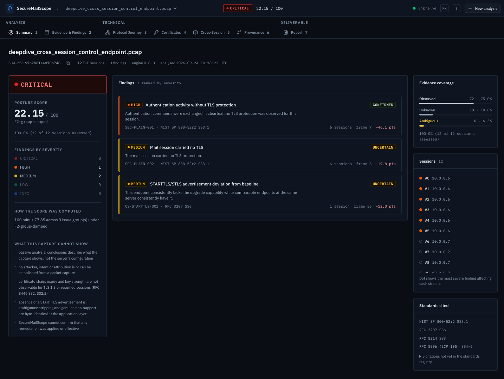
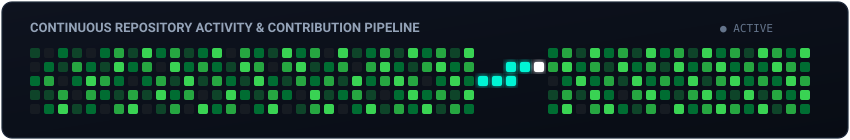

# Siddhant Patil

AI & Data Science Student at Pune Institute of Computer Technology (PICT), Pune  
Building practical systems across AI/ML, RAG, Computer Vision, Federated Learning, and Cybersecurity.

[LinkedIn](https://www.linkedin.com/in/siddhant-patil-50396532a/) &middot; [GitHub](https://github.com/Sidd927) &middot; [Email](mailto:siddhantpatil.hak@gmail.com)

---

## About Me

I am a third-year Artificial Intelligence & Data Science undergraduate at Pune Institute of Computer Technology (PICT), Pune. I focus on building practical software and machine learning systems, ranging from privacy-preserving distributed model training and agentic retrieval pipelines to passive network security auditing.

Alongside technical development, I serve as Head of Public Relations at the Startup & Innovation Cell (SIC), PICT, where I work with student founders, organize technical workshops, and support campus entrepreneurial initiatives. I actively build prototypes for hackathons and competitions, focusing on turning challenging problem statements into functional, testable implementations.

---

## Experience & Activities

| Role / Activity | Organization | Description |
|---|---|---|
| Head of Public Relations | Startup & Innovation Cell (SIC), PICT | Lead student outreach, startup community initiatives, and external communications. |
| Undergraduate Student | Pune Institute of Computer Technology (PICT) | B.E. in Artificial Intelligence & Data Science (2023 &ndash; Present). |
| Project Contributor | Smart India Hackathon (SIH 2026) | Built SecureMailScope for NTRO problem statement SIH26159 on passive email security. |
| Project Contributor | Samsung Solve for Tomorrow | Co-developed MEMORA, an offline edge cognitive companion prototype for memory assistance. |

---

## What I Work With

| Area | Technologies & Tools |
|---|---|
| Languages | Python, C++, TypeScript, JavaScript, SQL, Bash |
| AI & Machine Learning | PyTorch, MONAI, scikit-learn, YOLOv8, OpenCV, Sentence-Transformers |
| GenAI & RAG | LangGraph, LangChain, Qdrant, Self-RAG loops, NeMo Guardrails |
| Backend & Systems | FastAPI, Node.js, WebSockets, Docker, REST APIs |
| Frontend | React, Vite, Tailwind CSS, HTML5/CSS3 |
| Databases | PostgreSQL, SQLite, Redis |
| Networking & Security | Wireshark, tshark, Scapy, PCAP analysis |
| Tools & Workflow | Git, GitHub Actions, Linux, Postman |

---

## Featured Projects

| Project | Summary | Key Tech | Repository |
|---|---|---|---|
| [FedMed](https://github.com/Sidd927/FedMed) | Privacy-preserving federated learning prototype for 3D brain tumor segmentation | PyTorch, MONAI, FastAPI, React | [Code](https://github.com/Sidd927/FedMed) |
| [SecureMailScope](https://github.com/Sidd927/SecureMailScope) | Passive PCAP cryptographic security posture assessment for email | Python, tshark, Scapy, React | [Code](https://github.com/Sidd927/SecureMailScope) |
| [MEMORA](https://github.com/Sidd927/Samsung_Anchor) | Offline edge-AI cognitive companion prototype for memory support | Python, YOLO, SQLite, Edge Runtime | [Code](https://github.com/Sidd927/Samsung_Anchor) |
| [OmniBrain](https://github.com/Sidd927/OmniBrain) | Multi-modal agentic RAG orchestrator with specialized routing agents | LangGraph, Qdrant, FastAPI, PostgreSQL | [Code](https://github.com/Sidd927/OmniBrain) |
| [ResumeIQ](https://github.com/Sidd927/ResumeIQ) | Explainable resume-to-job matching engine with deterministic scoring | Python, FastAPI, React, PostgreSQL | [Code](https://github.com/Sidd927/ResumeIQ) |
| [ALPR Smart Parking](https://github.com/Sidd927/ALPR-Smart-Parking-System) | Real-time automatic number plate recognition and vehicle tracking | Python, YOLOv8, SORT, EasyOCR | [Code](https://github.com/Sidd927/ALPR-Smart-Parking-System) |

---

### FedMed

A research and engineering prototype for privacy-preserving federated 3D brain tumor segmentation. Instead of centralizing sensitive patient imaging across institutions, each simulated hospital node trains locally and only transmits model updates to a central aggregation coordinator.

* Implemented 3D segmentation using MONAI 3D U-Net architectures trained on the clinical BraTS-GLI 2024 cohort (1,350 subjects).
* Coordinated federated training across 4 simulated hospital partitions using weighted Federated Averaging (FedAvg).
* Integrated sample-level Differential Privacy with Poisson subsampling and analytical Rényi DP accounting ($\varepsilon = 2.8934, \delta = 10^{-5}$).
* Built a FastAPI backend with real-time WebSocket telemetry and a React/Vite dashboard featuring a multi-planar MRI slice visualizer.
* Backed by an automated test suite with 323 passing unit and integration tests.

Repository: [github.com/Sidd927/FedMed](https://github.com/Sidd927/FedMed)

---

### SecureMailScope

A passive network forensics tool developed for Smart India Hackathon (SIH 2026, Problem Statement SIH26159 for the National Technical Research Organisation - NTRO). It reads captured PCAP files from mail protocols (SMTP, IMAP, POP3) and reports on transport-layer security posture without actively connecting to servers or decrypting message content.

<div align="center">
  
</div>

* Analyzes TLS handshake negotiation, cipher suite strengths, forward secrecy (PFS), and STARTTLS/STLS upgrade integrity.
* Parses X.509 certificate chains where handshakes expose them in cleartext, correctly categorizing TLS 1.3 encrypted handshakes as unobservable per RFC 8446.
* Designed with a dependency-free Python core package and `tshark` parser for reliable execution in offline or air-gapped environments.
* Includes a FastAPI persistence service and an interactive analyst workbench frontend built in React and TypeScript.

Repository: [github.com/Sidd927/SecureMailScope](https://github.com/Sidd927/SecureMailScope) *(Private competition repository)*

---

### MEMORA (Samsung Solve for Tomorrow)

An offline edge-AI cognitive companion prototype developed for the Samsung Solve for Tomorrow competition. The system is designed as an ambient assistive aid for individuals with memory impairment and Alzheimer's, running locally without cloud dependence.

* Structured across 19 modular subsystems covering perception, working memory, routine tracking, and context restoration.
* Integrates on-device computer vision (YOLOv8) for recognizing familiar household objects and daily routine triggers.
* Implements local context management with SQLite to track daily events, routines, and reminders without external data transmission.
* Built with hardware abstraction layers targeted for low-power edge devices, backed by 479 unit and integration tests.

Repository: [github.com/Sidd927/Samsung_Anchor](https://github.com/Sidd927/Samsung_Anchor)

---

### OmniBrain

A multi-modal agentic RAG (Retrieval-Augmented Generation) orchestrator built to answer heterogeneous queries spanning prose documents, charts, and structured database tables.

```
                  User Query
                      |
           LangGraph Supervisor Router
         /            |             \
    Search Agent   Vision Agent   SQL Agent
    (Dense Prose)  (Chart/Plot)   (PostgreSQL)
         \            |             /
             Citation Synthesis
                      |
                Final Response
```

* Employs a LangGraph supervisor agent to classify query intent and route requests to specialized workers: a dense Search Agent (Qdrant 1536-dim), a Vision Agent (chart reasoning via PyMuPDF), or a SQL Agent (AST-validated SQL via sqlglot).
* Incorporates an iterative Self-RAG loop (`max_retries=2`) that inspects retrieved chunks, rewrites ambiguous search queries, and declines to answer when relevant evidence is missing.
* Includes two-tier fail-closed input guardrails to intercept prompt injections before model invocation.

Repository: [github.com/Sidd927/OmniBrain](https://github.com/Sidd927/OmniBrain) *(Private repository)*

---

### ResumeIQ

An explainable resume-to-job matching engine that calculates a transparent 0&ndash;100 match score across four deterministic signals, avoiding non-reproducible LLM scoring variance.

* Scoring formula: 40% Skill Match, 30% Semantic Relevance (`all-MiniLM-L6-v2`), 20% Title & Recency, and 10% Section Completeness.
* Built with a curated taxonomy of 119 technical skills and 307 synonyms to normalize terminology across resumes and job descriptions.
* FastAPI backend implemented with pure-function scoring, comprehensive Docker setup, and 96% backend unit test coverage.
* Accompanied by a responsive single-page web interface built with React, Vite, and Tailwind CSS.

Repository: [github.com/Sidd927/ResumeIQ](https://github.com/Sidd927/ResumeIQ)

---

### ALPR Smart Parking System

An edge computer vision pipeline integrating vehicle detection, multi-object tracking, and optical character recognition for automated parking management.

* Detects vehicles and license plate bounding boxes in video streams using custom fine-tuned YOLOv8 models.
* Uses SORT (Simple Online and Realtime Tracking) to maintain stable vehicle tracklet IDs across consecutive frames.
* Extracts alphanumeric plate characters via EasyOCR with bounding box normalization and confidence filtering.

Repository: [github.com/Sidd927/ALPR-Smart-Parking-System](https://github.com/Sidd927/ALPR-Smart-Parking-System)

---

## GitHub Activity

<div align="center">
  
</div>

<br/>

<div align="center">
  
</div>

---

## Connect

* **LinkedIn:** [linkedin.com/in/siddhant-patil-50396532a](https://www.linkedin.com/in/siddhant-patil-50396532a/)
* **GitHub:** [github.com/Sidd927](https://github.com/Sidd927)
* **Email:** [siddhantpatil.hak@gmail.com](mailto:siddhantpatil.hak@gmail.com)
* **Location:** Pune, India
