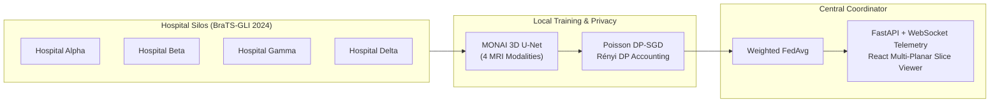

  Building practical AI/ML, computer vision, RAG, cybersecurity, and intelligent software systems.

&nbsp;

&nbsp;

---

## About

I am an Artificial Intelligence & Data Science undergraduate at Pune Institute of Computer Technology (PICT), Pune (Class of 2028). My work focuses on building practical, testable systems across machine learning, multi-modal retrieval-augmented generation (RAG), computer vision, privacy-preserving federated learning, and passive network security analysis.

I prioritize engineering depth, mathematically grounded algorithms, and deterministic guarantees over marketing veneer. Whether formulating Rényi differential privacy accounting for clinical 3D medical volumes or reverse-engineering encrypted email transport handshakes from raw PCAP captures, I focus on building reliable software from first principles with automated test coverage.

Alongside technical work, I serve as Head of Public Relations at the Startup & Innovation Cell (SIC), PICT, helping connect student founders, coordinate technical sessions, and cultivate the campus entrepreneurship ecosystem.

---

## Achievements

| Area / Event | Details |
| :--- | :--- |
| **Smart India Hackathon (SIH)** | Qualified for Smart India Hackathon twice through college internal selection — in 2nd year and 3rd year. |
| **SIH 2026 (NTRO Problem Statement)** | Developed **SecureMailScope** for Problem Statement SIH26159 on passive cryptographic security posture assessment of email transport protocols. |
| **Samsung Solve for Tomorrow** | Co-developed **MEMORA** (Release Candidate 1), an offline edge cognitive companion architecture for Alzheimer's routine assistance. |
| **Academic Standing** | Maintaining an **8.99 CGPA** in B.E. Artificial Intelligence & Data Science at Pune Institute of Computer Technology (PICT). |

---

## Tech Stack

### AI / Machine Learning

### Generative AI & RAG

### Backend & Systems

### Frontend & UI

### Databases & Storage

### Security & Analysis

---

## Featured Projects

| Project | Description | Stack | Links |
| :--- | :--- | :--- | :--- |
| **[FedMed](#fedmed)** | Privacy-preserving federated 3D brain tumor MRI segmentation platform using MONAI and Rényi DP. | `PyTorch` · `MONAI` · `FastAPI` · `React` | [Repository](https://github.com/Sidd927/FedMed) |
| **[SecureMailScope](#securemailscope)** | Passive PCAP security posture triage for SMTP/IMAP/POP3 email transport encryption (SIH / NTRO). | `Python` · `tshark` · `Scapy` · `React` | [Repository](https://github.com/Sidd927/SecureMailScope) &middot; [Demo](https://secure-mail-scope-psi.vercel.app) |
| **ResumeIQ** | Explainable candidate-job match engine with 4 deterministic scoring signals and 96% backend test coverage. | `FastAPI` · `React` · `TypeScript` · `PostgreSQL` | [Repository](https://github.com/Sidd927/ResumeIQ) &middot; [Demo](https://resume-iq-beta-henna.vercel.app/) |
| **MEMORA** | Deterministic offline edge-AI cognitive companion prototype for Alzheimer's ambient memory assistance. | `Python` · `YOLOv8` · `SQLite` · `Edge Runtime` | [Repository](https://github.com/Sidd927/Samsung_Anchor) |
| **IP-SAKTI Sahayak** | Multilingual source-grounded RAG assistant for Ayurvedic IPR across national and international legal regimes. | `Python` · `FastAPI` · `LangGraph` · `Qdrant` | [Repository](https://github.com/giyu-cmd/sih-2026) |
| **ALPR Smart Parking** | Real-time vehicle license plate detection, tracking, and parking management pipeline. | `Python` · `YOLOv8` · `SORT` · `EasyOCR` | [Repository](https://github.com/Sidd927/ALPR-Smart-Parking-System) |
| **OmniBrain** | Multi-modal agentic RAG orchestrator routing across prose documents, charts, and SQL databases. | `LangGraph` · `Qdrant` · `FastAPI` · `PostgreSQL` | *Private Repo* |

---

## Project Deep Dives

### FedMed

FedMed is a cross-silo federated learning platform engineered for 3D brain tumor MRI segmentation. Rather than centralizing sensitive medical imaging across institutions, each simulated hospital silo trains locally on multi-parametric MRI sequences and transmits model updates to a central aggregation coordinator under provable differential privacy guarantees.

* **Clinical 3D Segmentation:** Implemented volumetric segmentation using MONAI 3D U-Net architectures trained on the clinical BraTS-GLI 2024 cohort (1,350 subjects) across 4 multi-parametric MRI modalities (T1, T1-contrast, T2, FLAIR).
* **Decentralized Coordination:** Coordinated federated training across 4 simulated hospital partitions using weighted Federated Averaging (FedAvg), keeping raw MRI volumes strictly within their local boundaries.
* **Formal Privacy Guarantees:** Integrated sample-level Differential Privacy with Poisson subsampling and analytical Rényi DP accounting ($\varepsilon = 2.8934, \delta = 10^{-5}$).
* **Telemetry & Visualization:** Built a FastAPI backend with real-time WebSocket telemetry and a React/Vite dashboard featuring an interactive multi-planar MRI slice visualizer.
* **Verification:** Backed by an automated test suite with 323 passing unit and integration tests.

Repository: [github.com/Sidd927/FedMed](https://github.com/Sidd927/FedMed)

---

### SecureMailScope

Developed for Smart India Hackathon 2026 (Problem Statement SIH26159 for the National Technical Research Organisation &ndash; NTRO). SecureMailScope passively inspects captured PCAP network traffic from mail protocols (SMTP, IMAP, POP3) to evaluate transport-layer encryption posture across multiple sessions without active server probing, credentials, or payload decryption.

  

 

* **Passive Non-Invasive Triage:** Evaluates captured SMTP, IMAP, and POP3 network traffic without connecting to mail servers, requiring credentials, or decrypting message payloads.
* **Transport Cryptographic Auditing:** Dissects TLS handshake negotiation, cipher suite strengths, forward secrecy (PFS), plaintext exposure, and STARTTLS/STLS downgrade tampering.
* **RFC 8446 Compliance:** Parses X.509 certificate chains where handshakes expose them in cleartext, correctly treating TLS 1.3 encrypted handshakes as unobservable.
* **Air-Gapped Portability:** Core packet dissection and posture engine written with pure Python standard library and `tshark` with zero external runtime dependencies for offline or air-gapped forensic environments.
* **Analyst Workbench:** Features an optional FastAPI persistence service and an interactive analyst dashboard built in React and TypeScript.

Repository: [github.com/Sidd927/SecureMailScope](https://github.com/Sidd927/SecureMailScope) &middot; Live Prototype: [secure-mail-scope-psi.vercel.app](https://secure-mail-scope-psi.vercel.app)

---

## Experience

| Role | Organization | Focus & Highlights |
| :--- | :--- | :--- |
| **Head of Public Relations** | Startup & Innovation Cell (SIC), PICT | Directing student outreach, startup community initiatives, external communications, and campus technical sessions to support student founders and early-stage ventures. |
| **Student Engineer** | Pune Institute of Computer Technology (PICT) | B.E. in Artificial Intelligence & Data Science ('28) &middot; CGPA 8.99 &middot; Focus on ML systems, computer vision, and network security. |

---

## Connect

* **LinkedIn:** [linkedin.com/in/siddhant-patil-50396532a](https://www.linkedin.com/in/siddhant-patil-50396532a/)
* **GitHub:** [github.com/Sidd927](https://github.com/Sidd927)
* **Email:** [siddhantpatil.hak@gmail.com](mailto:siddhantpatil.hak@gmail.com)

Open to collaborations, research projects, technical initiatives, and software engineering opportunities.

 

  Siddhant Patil &middot; 2026

