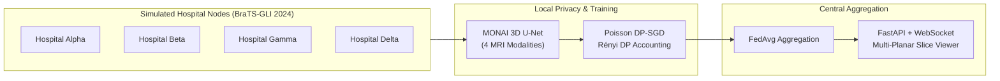
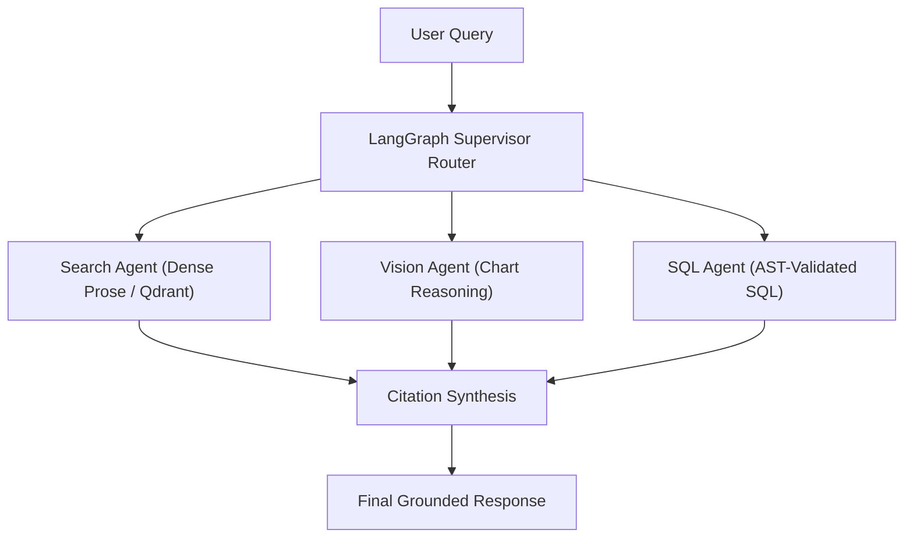

  

&nbsp;

&nbsp;

---

## About Me

I am a third-year Artificial Intelligence & Data Science undergraduate at Pune Institute of Computer Technology (PICT), Pune. My technical focus centers on building practical, testable systems across AI/ML, multi-modal RAG, computer vision, federated learning with differential privacy, and passive network security analysis.

Alongside engineering, I serve as Head of Public Relations at the Startup & Innovation Cell (SIC), PICT, where I work with student founders, organize technical initiatives, and support campus innovation. I actively participate in hackathons (Smart India Hackathon, Samsung Solve for Tomorrow), focusing on translating real-world problem statements into working prototypes.

---

## Experience & Activities

| Role / Activity | Organization | Focus / Details |
| :--- | :--- | :--- |
| Head of Public Relations | Startup & Innovation Cell (SIC), PICT | Leading student outreach, startup community initiatives, external communications, and campus technical sessions. |
| AI & Data Science Undergraduate | Pune Institute of Computer Technology (PICT) | Bachelor of Engineering in Artificial Intelligence & Data Science (2023 &ndash; Present). |
| Technical Contributor | Smart India Hackathon (SIH 2026) | Built SecureMailScope for the National Technical Research Organisation (NTRO) problem statement SIH26159. |
| Technical Contributor | Samsung Solve for Tomorrow | Co-developed MEMORA, an offline edge cognitive companion prototype for memory assistance. |

---

## Technical Toolkit

### Languages

### AI & Machine Learning

### Generative AI & RAG

### Backend & Systems

### Frontend & Databases

### Security & Analysis

---

## Featured Projects

| Project | Description | Stack | Repository |
| :--- | :--- | :--- | :--- |
| [FedMed](#fedmed) | Privacy-preserving federated learning prototype for 3D brain tumor segmentation | PyTorch, MONAI, FastAPI, React | [GitHub](https://github.com/Sidd927/FedMed) |
| [SecureMailScope](#securemailscope) | Passive PCAP-based email transport security analysis for SMTP/IMAP/POP3 | Python, tshark, Scapy, React | [GitHub](https://github.com/Sidd927/SecureMailScope) |
| [MEMORA](#memora-samsung-solve-for-tomorrow) | Offline cognitive companion / edge AI prototype (Samsung Solve for Tomorrow) | Python, YOLO, SQLite, Edge Runtime | [GitHub](https://github.com/Sidd927/Samsung_Anchor) |
| [OmniBrain](#omnibrain) | Multi-modal agentic RAG orchestrator with specialized routing agents | LangGraph, Qdrant, FastAPI, PostgreSQL | [GitHub](https://github.com/Sidd927/OmniBrain) |

---

### FedMed

A research and engineering prototype for privacy-preserving federated 3D brain tumor segmentation. Instead of centralizing sensitive patient imaging across institutions, each simulated hospital node trains locally and only transmits model updates to a central aggregation coordinator.

* Implemented 3D segmentation using MONAI 3D U-Net architectures trained on the clinical BraTS-GLI 2024 dataset (1,350 subjects).
* Coordinated decentralized federated training across 4 simulated hospital partitions using weighted Federated Averaging (FedAvg), keeping raw MRI volumes local.
* Integrated sample-level Differential Privacy with Poisson subsampling and analytical Rényi DP accounting ($\varepsilon = 2.8934, \delta = 10^{-5}$).
* Built a FastAPI backend with real-time WebSocket telemetry and a React/Vite dashboard featuring a multi-planar MRI slice visualizer.
* Backed by an automated test suite with 323 passing unit and integration tests.

Repository: [github.com/Sidd927/FedMed](https://github.com/Sidd927/FedMed)

---

### SecureMailScope

A passive network forensics tool developed for Smart India Hackathon (SIH 2026, Problem Statement SIH26159 for the National Technical Research Organisation - NTRO). It reads captured PCAP files from mail protocols (SMTP, IMAP, POP3) and reports on transport-layer security posture without actively connecting to servers or decrypting message content.

  

 

* Passively inspects captured SMTP, IMAP, and POP3 network traffic to evaluate transport encryption posture without active scanning.
* Analyzes TLS handshake negotiation, cipher suite strengths, forward secrecy (PFS), and STARTTLS/STLS upgrade tampering.
* Parses X.509 certificate chains where handshakes expose them in cleartext, correctly categorizing TLS 1.3 encrypted handshakes as unobservable per RFC 8446.
* Implemented with a dependency-free Python core package and `tshark` parser for reliable execution in offline or air-gapped environments.
* Includes an optional FastAPI persistence service and an interactive analyst workbench frontend built in React and TypeScript.

Repository: [github.com/Sidd927/SecureMailScope](https://github.com/Sidd927/SecureMailScope) *(Private competition repository)*

---

### MEMORA (Samsung Solve for Tomorrow)

An offline edge-AI cognitive companion prototype developed for the Samsung Solve for Tomorrow competition. The system is designed as an ambient assistive aid for individuals with memory impairment and Alzheimer's, running locally without cloud dependence.

* Structured across 19 modular subsystems covering perception, working memory, routine tracking, and context restoration.
* Integrates on-device computer vision (YOLOv8) to recognize familiar household items and identify daily routine triggers.
* Implements local context management with SQLite to track daily events, routines, and reminders without external data transmission.
* Built with hardware abstraction layers targeted for low-power edge devices, backed by 479 unit and integration tests.

Repository: [github.com/Sidd927/Samsung_Anchor](https://github.com/Sidd927/Samsung_Anchor)

---

### OmniBrain

A multi-modal agentic RAG (Retrieval-Augmented Generation) orchestrator built to answer heterogeneous enterprise queries across prose documents, charts, and structured database tables.

* Employs a LangGraph supervisor agent to classify query intent and route requests to specialized workers: dense text search (Qdrant 1536-dim), visual chart reasoning (PyMuPDF), or database execution (AST-validated SQL via sqlglot).
* Incorporates an iterative Self-RAG loop (`max_retries=2`) that inspects retrieved chunks, rewrites ambiguous search queries, and declines to answer when relevant evidence is missing.
* Includes two-tier fail-closed input guardrails to intercept prompt injections before model invocation.

Repository: [github.com/Sidd927/OmniBrain](https://github.com/Sidd927/OmniBrain) *(Private repository)*

---

## Other Projects

| Project | What it does | Stack | Repository |
| :--- | :--- | :--- | :--- |
| **ResumeIQ** | Explainable candidate-job matching engine with 4 deterministic scoring signals and 96% backend test coverage | Python, FastAPI, React, PostgreSQL | [GitHub](https://github.com/Sidd927/ResumeIQ) |
| **ALPR Smart Parking** | Real-time vehicle license plate detection and multi-object tracking pipeline | Python, YOLOv8, SORT, EasyOCR | [GitHub](https://github.com/Sidd927/ALPR-Smart-Parking-System) |
| **IP-SAKTI Sahayak** | Multilingual legal and regulatory RAG prototype for Ayurvedic IPR (Smart India Hackathon 2026) | Python, FastAPI, LangGraph, Qdrant | [GitHub](https://github.com/lunarrr17/sih-2026) |

---

## Achievements

| Recognition / Event | Context |
| :--- | :--- |
| Samsung Solve for Tomorrow Contender | Co-developed MEMORA (Release Candidate 1) — offline edge cognitive architecture for Alzheimer's support. |
| Smart India Hackathon 2026 Contender | Developed SecureMailScope for NTRO Problem Statement SIH26159 on passive email transport security. |
| First Prize Winner | Magnitude National Hackathon (D.Y. Patil College of Engineering). |

---

## GitHub Activity

  

---

## Connect

* **LinkedIn:** [linkedin.com/in/siddhant-patil-50396532a](https://www.linkedin.com/in/siddhant-patil-50396532a/)
* **GitHub:** [github.com/Sidd927](https://github.com/Sidd927)
* **Email:** [siddhantpatil.hak@gmail.com](mailto:siddhantpatil.hak@gmail.com)

Open to collaborations, hackathons, research projects, and interesting software engineering opportunities.

 

  Siddhant Patil &middot; 2026

